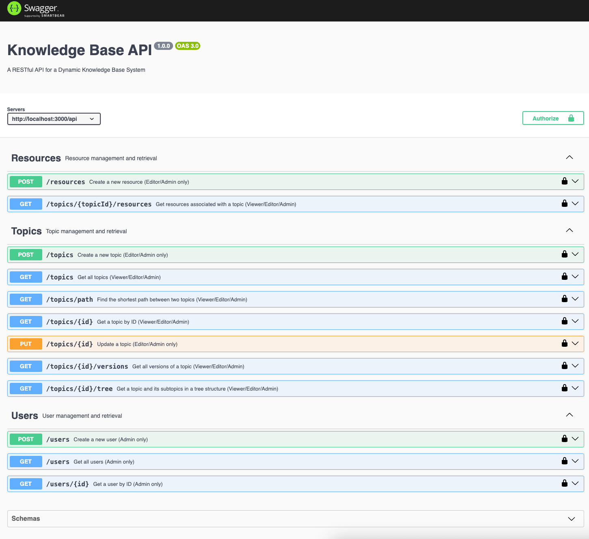

# Dynamic Knowledge Base System

This project implements a robust and scalable RESTful API for a Dynamic Knowledge Base System.

## Tech Stack

- **Backend:** Node.js, Express.js, TypeScript
- **Database:** PostgreSQL (via Docker)
- **ORM:** TypeORM
- **Logging:** Winston
- **Testing:** Jest
- **API Documentation:** Swagger / Swagger UI

## Table of Contents

- [Dynamic Knowledge Base System](#dynamic-knowledge-base-system)
  - [Tech Stack](#tech-stack)
  - [Table of Contents](#table-of-contents)
  - [Project Setup](#project-setup)
  - [Running the Project](#running-the-project)
  - [Database Setup](#database-setup)
    - [PostgreSQL (Default)](#postgresql-default)
    - [In-memory SQLite](#in-memory-sqlite)
  - [API Documentation (Swagger)](#api-documentation-swagger)
  - [API Endpoints](#api-endpoints)
    - [Users](#users)
    - [Topics](#topics)
    - [Resources](#resources)
  - [Authentication](#authentication)
    - [Creating Users](#creating-users)
    - [Using the `x-user-id` header](#using-the-x-user-id-header)
  - [Testing](#testing)
  - [Technical Decisions and Project Insights](#technical-decisions-and-project-insights)

## Project Setup

To set up the project locally, follow these steps:

1.  **Prerequisites:**
    *   Node.js (v18 or higher)
    *   npm (v8 or higher)
    *   Docker and Docker Compose (for database setup)
    *   Git

2.  **Clone the repository:**
    ```bash
    git clone https://github.com/mzaghetto/projectmark-test.git
    cd projectmark-test
    ```

3.  **Install dependencies:**
    ```bash
    npm install
    ```

## Running the Project

To run the project, follow these steps:

1.  **Configure Environment Variables:**
    Copy the `.env.example` file to `.env` and configure your environment variables. The default port is `3000`.
    ```bash
    cp .env.example .env
    ```

2.  **Start Docker Containers (Database):**
    Ensure Docker is running and start the necessary services (e.g., database):
    ```bash
    docker-compose up -d
    ```
    This will start a PostgreSQL container named `db` and expose it on port `5432`.

3.  **Start the Development Server:**
    ```bash
    npm run start:dev
    ```
    The server will be running at the port specified in your `.env` file (default: `http://localhost:3000`).

4.  **Create your first user (admin):**
    ```bash
    npm run create-admin
    ```
    This will use a script to create an admin account for your use
    > Look in terminal logs to get the admin user id to use in the "Authorizer / `x-user-id`" or connect into your database to get the admin id

## Database Setup

This project supports two database options: PostgreSQL (default) and in-memory SQLite.

### PostgreSQL (Default)

This project uses PostgreSQL as its database, managed via Docker. Follow these steps to set up the database:

1.  **Ensure Docker is running:** Make sure Docker Desktop or your Docker daemon is active on your system.

2.  **Start the PostgreSQL container:** From the project root directory, run:
    ```bash
    docker-compose up -d db
    ```
    This will start a PostgreSQL container named `db` and expose it on port `5432`.

    *   **Database Name:** `knowledge_base_db`
    *   **User:** `user`
    *   **Password:** `password`

3.  **Stop the PostgreSQL container (optional):**
    ```bash
    docker-compose down
    ```

### In-memory SQLite

To use an in-memory SQLite database, set the `DATABASE_TYPE` environment variable to `sqlite` in your `.env` file:

```
DATABASE_TYPE=sqlite
```

This is useful for quick local development or testing without needing a running Docker container.

## API Documentation (Swagger)

The API is fully documented using Swagger UI. Once the server is running, you can access the interactive API documentation at:

`http://localhost:3000/api-docs`

This interface allows you to explore all available endpoints, understand request/response schemas, and even test API calls directly from your browser.


*Figure: Screenshot of the Swagger UI interface.*

## API Endpoints

All API endpoints are prefixed with `/api`. For detailed information on each endpoint, including request bodies and response structures, please refer to the [Swagger UI](#api-documentation-swagger).

### Users

*   **Create User (Admin only):** `POST /api/users`
*   **Get All Users (Admin only):** `GET /api/users`
*   **Get User by ID (Admin only):** `GET /api/users/:id`

### Topics

*   **Create Topic (Editor/Admin only):** `POST /api/topics`
*   **Get All Topics (Viewer/Editor/Admin):** `GET /api/topics`
*   **Get Topic by ID (Viewer/Editor/Admin):** `GET /api/topics/:id`
*   **Update Topic (Editor/Admin only):** `PUT /api/topics/:id`
*   **Get Topic Versions (Viewer/Editor/Admin):** `GET /api/topics/:id/versions`
*   **Get Topic Tree (Viewer/Editor/Admin):** `GET /api/topics/:id/tree`
*   **Find Shortest Path between Topics (Viewer/Editor/Admin):** `GET /api/topics/path?startTopicId=<id>&endTopicId=<id>`

### Resources

*   **Create Resource (Editor/Admin only):** `POST /api/resources`
*   **Get Resources by Topic (Viewer/Editor/Admin):** `GET /api/topics/:topicId/resources`

## Authentication

Authentication is handled via a custom middleware that checks the `x-user-id` header. To access protected routes, you must include this header with a valid user ID.

### Creating Users

There are two primary ways to create users in this system:

1.  **Creating the Initial Admin User via Script:**
    For convenience and to ensure proper setup, an admin user can be created by running a dedicated script. This method will create an admin user with predefined credentials (email: `admin@example.com`, name: `Admin User`).

    **Note for In-memory SQLite (`DATABASE_TYPE=sqlite`):** When using the in-memory database, the admin user is automatically created on application startup. You only need to run this script if you are using PostgreSQL and want to create an admin user without direct database interaction.

    To create the admin user:
    ```bash
    npm run create-admin
    ```
    This script will create an admin user if one does not already exist with the specified email. The ID for this user will be automatically generated by the system and printed to the console. Use this ID for the `x-user-id` header.

2.  **Creating Users via the API (After Initial Admin Setup):**
    Once an initial admin user is set up, other users (including additional admins, editors, or viewers) can be created using the API. The user ID will be automatically generated by the system.

    *   **Create User (Admin only):**
        *   `POST /api/users`
        *   Body:
            ```json
            {
                "name": "Jane Doe",
                "email": "jane.doe@example.com",
                "role": "Editor"
            }
            ```
        *   **Note:** The `id` for API-created users is automatically generated by the system. You do not need to provide it in the request body. The response will include the generated ID.

### Using the `x-user-id` header

When making requests to protected endpoints, include the `x-user-id` header with the ID of a user that has the necessary permissions.

For example, to create a new topic as an Editor:

```
POST /api/topics
Headers:
  x-user-id: <editor-user-id>
Body:
  {
      "name": "New Topic",
      "content": "Content of the new topic."
  }
```

## Testing

The project includes a comprehensive suite of unit and integration tests to ensure reliability and correctness.

To run the tests:

```bash
npm run test:unit
npm run test:integration
```

**Test Coverage:** The project currently boasts **100% test coverage** for the services ensuring high code quality and stability.
```bash
PASS  src/services/TopicService.test.ts
PASS  src/services/ResourceService.test.ts
PASS  src/services/UserService.test.ts
--------------------|---------|----------|---------|---------|-------------------
File                | % Stmts | % Branch | % Funcs | % Lines | Uncovered Line #s
--------------------|---------|----------|---------|---------|-------------------
All files           |     100 |      100 |     100 |     100 |
 ResourceService.ts |     100 |      100 |     100 |     100 |
 TopicService.ts    |     100 |      100 |     100 |     100 |
 UserService.ts     |     100 |      100 |     100 |     100 |
--------------------|---------|----------|---------|---------|-------------------

Test Suites: 3 passed, 3 total
Tests:       31 passed, 31 total
Snapshots:   0 total
Time:        3.647 s, estimated 4 s
Ran all test suites.
```

```bash
PASS  test/integration/user.test.ts
PASS  test/integration/topic.test.ts
PASS  test/integration/resource.test.ts

Test Suites: 3 passed, 3 total
Tests:       45 passed, 45 total
Snapshots:   0 total
Time:        13.177 s
Ran all test suites.
```

## Technical Decisions and Project Insights

For a deeper dive into the architectural choices, design patterns, and specific implementation details, including insights into the database schema for hierarchical topics and advanced logging configurations, please refer to the dedicated document:

[TECHNICAL_DECISIONS.md](./TECHNICAL_DECISIONS.md)
